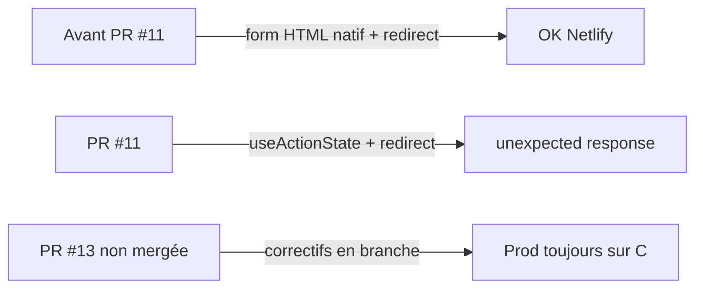
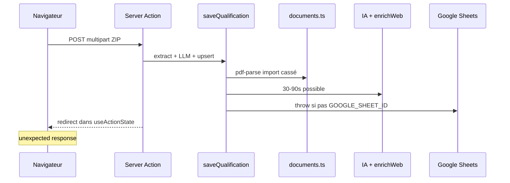
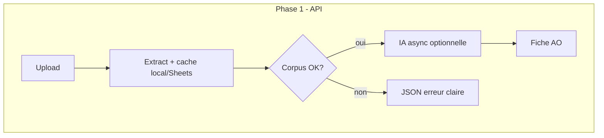

# Plan de récupération — Génération fiche qualification AO

**Date d’audit :** mai 2026  
**Symptôme prod :** `An unexpected response was received from the server` après upload ZIP/PDF — la fiche ne se génère jamais.  
**URL prod :** `https://bizdevcompanionsiama.netlify.app`

---

## 1. Synthèse exécutive

| Constat | Impact |
|--------|--------|
| **La PR #13 (correctifs) n’est pas sur `main`** | Netlify déploie encore la version cassée (PR #11 uniquement). |
| **Régression introduite par la PR #11** (`dc16a8b`) | Passage de `<form action={…}>` à `useActionState` + `redirect()` → erreur Next.js systématique en succès. |
| **Bug `pdf-parse` en serverless** | Chaque PDF dans un ZIP peut faire échouer l’extraction (ENOENT fichier de test). |
| **Pipeline synchrone trop long** | ZIP + OCR + recherche web + LLM 16k tokens > timeout Netlify (~26–60 s). |
| **Google Sheets absent** | Provoquait une exception avant correctif cache local (PR #13). |

**Ce n’est pas une régression « métier » des AO : c’est une rupture technique du transport HTTP (Server Action) + charge serverless.**

---

## 2. Chronologie (pourquoi « ça marchait avant »)

### Avant PR #11 (`ee66fcc`)

- Formulaire : `<form action={qualificationAction}>` **sans** `useActionState`.
- `redirect()` après succès : **compatible** avec soumission de formulaire classique.
- Un seul champ fichier `document` (PDF/DOCX/TXT/ZIP).
- `pdf-parse` déjà présent mais ZIP moins exposé dans l’UI.

### PR #11 (`dc16a8b`) — point de rupture

- Nouveau `QualificationForm` client avec **`useActionState(qualificationAction)`**.
- `qualificationAction` garde **`redirect()`** en fin de succès → réponse RSC invalide pour le client → message exact observé.
- Multi-documents (Avis / CPS / RC / ZIP), `error.tsx` segment AO.
- OCR « requis mais non configuré » sur PDF scannés.

### PR #13 (branche `cursor/fix-pdf-parse-import-ba85`) — correctifs prêts, **non déployés**

- Suppression redirect / useActionState (partiel) → remplacé ici par **retour au form natif** (plus fiable).
- Import `pdf-parse/lib/pdf-parse.js`.
- OCR Tesseract par défaut, images dans ZIP.
- Cache pipeline si `GOOGLE_SHEET_ID` absent.
- `maxDuration = 60`, `bodySizeLimit = 26mb`.

---

## 3. Cartographie du flux actuel (prod `main`)

### Étapes et risques

| # | Étape | Fichier | Risque bloquant |
|---|--------|---------|-----------------|
| 1 | Auth session | `requireUser()` | Session expirée + redirect mal propagé |
| 2 | Upload FormData | Netlify / Next | > 20 Mo (prod) → 413 HTML |
| 3 | Extraction ZIP/PDF | `documents.ts` | pdf-parse ENOENT, OCR lourd |
| 4 | Corpus vide | `aoService.ts` | Erreur métier (OK dans formulaire) |
| 5 | Recommandation LLM | `llm.ts` | Lent, pas bloquant si pas de clé |
| 6 | Fiche intelligente | `intelligence.ts` | **16k tokens + enrichWeb** → timeout |
| 7 | Persistance | `aoRepository.ts` | Sheets non configuré |
| 8 | Réponse client | `actions.ts` | **useActionState + redirect** → **bloquant #1** |

---

## 4. Points de blocage (priorisés)

### P0 — Bloquants immédiats (prod actuelle)

1. **Formulaire dans un composant `"use client"`** : même avec `action={serverAction}`, Next.js utilise le **protocole Server Action** (fetch RSC), pas un POST HTML → `redirect()` / timeout = *unexpected response*. **Correctif : route API JSON + `fetch`.**
2. **`useActionState` + `redirect()`** (PR #11, corrigé partiellement)  
3. **Import `pdf-parse/index.js`** sur chaque PDF en ZIP  

### P1 — Bloquants fréquents (ZIP 2,9 Mo)

4. **Timeout serverless** : OCR × N fichiers + LLM long  
5. **`bodySizeLimit` 20 Mo** sur `main` vs ZIP 25 Mo accepté côté app  
6. **`GOOGLE_SHEET_ID` absent** → exception non gérée sur `main`  

### P2 — Qualité / résilience

7. Pas de retour d’erreur métier dans le formulaire (erreur = boundary segment)  
8. `enrichWeb` coché par défaut → +8 s minimum  
9. Cache local Netlify `/tmp` non durable entre instances  
10. Pas de test E2E qualification sur Netlify preview  

---

## 5. Plan d’implémentation définitif

### Phase 0 — Déblocage immédiat (J0, 1 merge)

**Objectif :** retrouver un parcours qui fonctionne comme avant PR #11, avec les nouvelles fonctionnalités multi-documents.

| Action | Détail | Critère de succès |
|--------|--------|-------------------|
| **0.1 Merger PR #13** (+ correctif form natif) | `main` → deploy Netlify | Preview génère une fiche sur TXT ou ZIP léger |
| **0.2 Form natif** | `<form action={qualificationAction}>` sans `useActionState` | Plus de `unexpected response` au succès |
| **0.3 Erreurs via URL** | `?qualError=` sur `/qualification` | Message français dans le formulaire, pas seulement `error.tsx` |
| **0.4 pdf-parse** | Import `lib/pdf-parse.js` | ZIP avec PDF ne crash plus |
| **0.5 Sheets fallback** | Cache local si pas `GOOGLE_SHEET_ID` | Génération aboutit avec bannière explicite |

**Tests de validation prod :**

1. Fichier `.txt` seul (Avis) — < 10 s  
2. ZIP 2,9 Mo (votre cas) — < 60 s ou message timeout explicite  
3. Sans `GOOGLE_SHEET_ID` en preview — fiche visible sur fiche AO  

---

### Phase 1 — Robustesse serverless (1 sprint technique)

**Objectif :** ne plus dépendre d’une seule Server Action monolithique.

| Action | Détail |
|--------|--------|
| **1.1 Pipeline en 2 temps** | Étape A : extraction + sauvegarde corpus (rapide). Étape B : IA (optionnelle, relançable). |
| **1.2 Route API dédiée** | `POST /api/ao/[aoNum]/qualification` retourne JSON `{ ok, error, step }` — pas de redirect dans le corps RSC. |
| **1.3 Timeout budget** | OCR max 20 s, LLM max 25 s, total plafonné ; message « Relancez sans enrichissement web ». |
| **1.4 enrichWeb désactivé par défaut** | Case décochée ; gain 5–15 s. |
| **1.5 OCR progressif** | Texte natif PDF d’abord ; Tesseract seulement si < 180 caractères ; max 4 pages PDF. |
| **1.6 Observabilité** | `GET /api/health/qualification` : Sheets, LLM, pdf-parse, durée dernier job. |

---

### Phase 2 — Expérience utilisateur & persistance (1 sprint produit)

| Action | Détail |
|--------|--------|
| **2.1 Barre de progression réelle** | Étapes : upload → extraction → OCR → IA → enregistrement |
| **2.2 Persistance durable sans Sheets** | Option Supabase / Blob Netlify pour fiches si pas Google |
| **2.3 Reprise après échec** | Conserver corpus extrait même si LLM timeout |
| **2.4 E2E Playwright** | Scénario qualification TXT + ZIP sur preview Netlify |
| **2.5 Smoke post-deploy** | `scripts/smoke-qualification.mjs` dans CI |

---

### Phase 3 — Prévention régression (continu)

| Garde-fou | Implémentation |
|-----------|----------------|
| Test « pas de redirect dans action useActionState » | Déjà dans `qualificationAction.test.ts` → étendre |
| Test import pdf-parse | `documentsBuffer.test.ts` |
| Checklist release | Merger + smoke preview avant prod |
| Feature flag | `QUALIFICATION_USE_LEGACY_FORM=true` (défaut true jusqu’à phase 1 validée) |

---

## 6. Configuration Netlify recommandée

Variables **requises** pour une persistance durable :

- `GOOGLE_SHEET_ID`
- `GOOGLE_CLIENT_ID`, `GOOGLE_CLIENT_SECRET`, `GOOGLE_REFRESH_TOKEN`
- `ANTHROPIC_API_KEY` ou `OPENAI_API_KEY` (fiche intelligente complète)
- `SESSION_SECRET`, `APP_USER_EMAIL`, `APP_USER_PASSWORD`

Variables **optionnelles** (améliorent mais ne bloquent plus) :

- `OCR_PROVIDER` — défaut `tesseract` après PR #13
- `LLM_QUALIFICATION_MAX_TOKENS` — réduire à `8192` si timeouts

**Aucune config OCR Azure n’est nécessaire** après PR #13.

---

## 7. Matrice de diagnostic rapide

| Message / comportement | Cause probable | Action |
|------------------------|----------------|--------|
| `unexpected response` | PR #11 sur prod, redirect + useActionState | Merger PR #13 + form natif |
| Erreur dans bandeau jaune formulaire | Erreur métier catchée | Lire `qualError`, ajouter extrait manuel |
| Page Erreur AO timeout | LLM/OCR > limite Netlify | Décocher enrichWeb, ZIP plus petit, phase 1 API |
| `Configuration Google incomplète` | Pas `GOOGLE_SHEET_ID` sur `main` | Merger PR #13 ou configurer Sheets |
| Fiche vide / pas d’IA | Pas de clé LLM | Configurer Anthropic/OpenAI |

---

## 8. Ordre d’exécution recommandé (checklist)

- [ ] Merger `cursor/fix-pdf-parse-import-ba85` → `main`
- [ ] Vérifier deploy Netlify réussi (commit contient form natif + pdf-parse fix)
- [ ] Test 1 : TXT seul
- [ ] Test 2 : ZIP 2,9 Mo Office des Changes
- [ ] Vérifier variables Netlify (Sheets + LLM)
- [ ] Planifier Phase 1 (API async) si ZIP > 60 s encore
- [ ] Ajouter smoke CI qualification

---

## 9. Références code

| Zone | Fichiers |
|------|----------|
| Transport HTTP | `src/app/ao/actions.ts`, `QualificationForm.tsx` |
| Métier | `src/lib/aoService.ts` → `saveQualification` |
| Documents | `src/lib/documents.ts`, `src/lib/ocr/*` |
| Persistance | `src/lib/aoRepository.ts`, `src/lib/pipelineLocalCache.ts` |
| IA | `src/lib/qualification/intelligence.ts`, `research.ts` |
| Régression | Commit `dc16a8b` (PR #11) |
